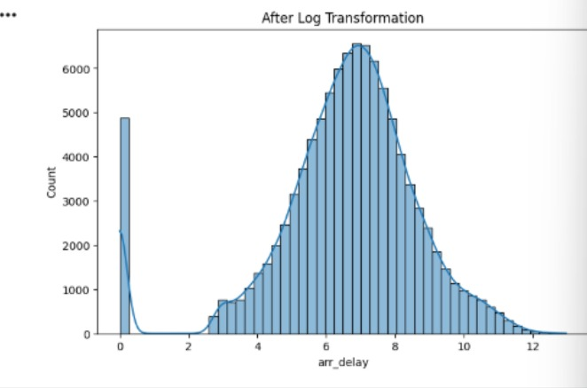
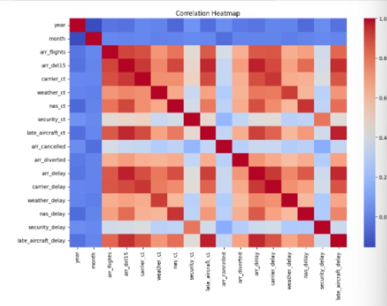
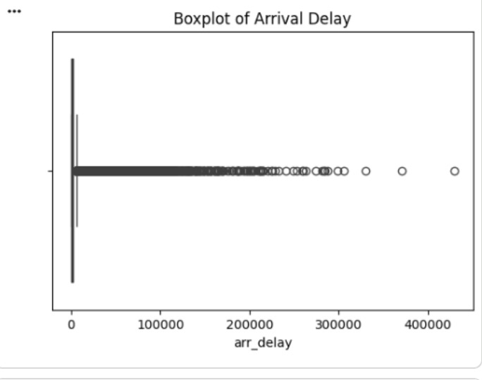
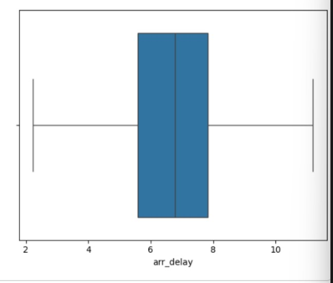

# Airline Delay Prediction

A machine learning project focused on analyzing and predicting flight delays in US airlines using historical flight data. The system predicts whether a flight will be delayed and helps identify key factors affecting airline delays.

---

## Objective

The project aims to:

- Predict whether a flight will be delayed by 15 minutes or more
- Analyze major causes of flight delays
- Compare machine learning models for classification performance
- Improve prediction reliability through feature engineering and preprocessing

---

## Dataset

The dataset contains 100K+ historical US airline flight records including:

- Airline carrier
- Origin airport
- Destination airport
- Departure & arrival timings
- Distance
- Delay reasons
- Flight duration

---

## Features Implemented

- Data Cleaning & Missing Value Handling
- Outlier Treatment using IQR Capping & Log Transformation
- Exploratory Data Analysis (EDA)
- Feature Engineering
- Removal of Target Leakage Features
- Data Standardization & Encoding
- Model Training & Evaluation

---

## Machine Learning Models Used

- Logistic Regression
- Random Forest Classifier

---

## Tech Stack

- Python
- Pandas
- NumPy
- Matplotlib
- Seaborn
- Scikit-learn
- Jupyter Notebook

---

## Model Performance

| Model | Accuracy |
|---|---|
| Logistic Regression | ~97% |
| Random Forest | ~96% |

Logistic Regression was selected for its simplicity, interpretability, and strong performance.

---

## Key Insights

- Peak-hour departures showed higher delay probabilities
- Certain airlines consistently experienced longer delays
- Departure congestion significantly impacted flight timings
- Feature engineering improved prediction reliability

- ---

## Exploratory Data Analysis & Preprocessing

### Distribution of Flight Delays

The original arrival delay data showed heavy right skewness and significant outliers.



---

### Correlation Heatmap

Correlation analysis helped identify strong feature dependencies between delay-related attributes.



---

### Outlier Analysis Before Transformation

Initial boxplots revealed extreme outliers in arrival delay values.



---

### Outlier Analysis After Log Transformation

Log transformation and preprocessing significantly reduced skewness and stabilized the distribution.



---

---

## Project Structure

```bash
airline-delay-prediction/
│
├── data/
├── notebooks/
├── visuals/
├── models/
├── requirements.txt
└── README.md
```

---

## Future Improvements

- Real-time flight delay prediction
- Streamlit deployment
- Weather API integration
- Live dashboard visualization

---

## Author

Suraj16032005
